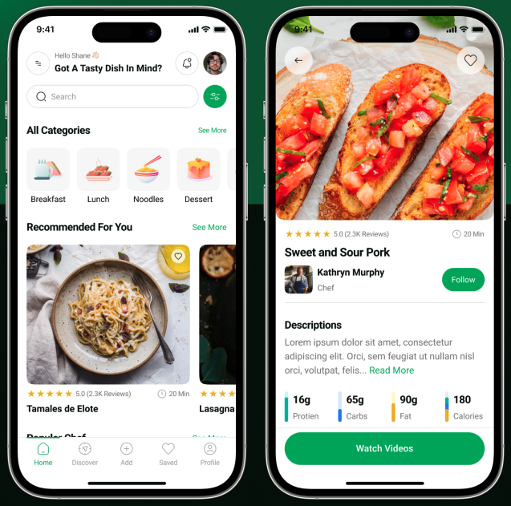

<p align="center">
  
</p>

<h1 align="center">Recipe Tin UI Design System</h1>

Recipe Tin UI Design System provides reusable UI components, design tokens, and foundations that help build a consistent, accessible, and scalable digital recipe box. Inspired by the classic kitchen tin filled with handwritten recipe cards, it keeps all the building blocks for discovering, saving, and sharing recipes in one place.

This guide walks you through installing and using the design system in your project.

<hr size="4" color="#ededed">

What this includes:

- Reusable React components (buttons, cards, forms, navigation, ratings, and more)
- Design foundations (color, typography, spacing, layout, and border radius)
- Accessibility-first patterns and implementation guidance
- Storybook documentation with examples and usage notes

Using shared standards helps teams:

- Build faster with less duplication
- Maintain visual and behavioral consistency
- Improve onboarding for designers and developers
- Deliver predictable, confidence-inspiring product experiences

The system is built on:

- Design tokens
- Accessibility standards
- Interaction principles
- Responsive layout rules

## Get Started

```
npm install github:svonharris/recipe-tin-ui
```

### Peer Dependencies

<hr width="50%" align="left">

Make sure your project includes the required peer dependencies:

```
npm install react react-dom
```

If you're using TypeScript:

```
npm install -D typescript @types/react @types/react-dom
```

### Using Components

<hr width="50%" align="left">

Import components directly:

```
import { Button } from 'recipe-tin-ui';

export function Example() {
    return <Button variant="primary">Browse Recipes</Button>;
}
```

### Using Design Tokens

<hr width="50%" align="left">

Design tokens are available for direct use in CSS.

```
.my-card {
  background: var(--color-surface-primary);
  border-radius: var(--border-radius-md);
}
```

<hr size="4" color="#ededed">

## Documentation

Interactive documentation and live examples are published via [GitHub](https://svonharris.github.io/recipe-tin-ui/?path=/docs/docs-introduction--docs). There you can:

- Explore components
- View accessibility notes
- Inspect props and variants
- Review usage guidelines

### Run Storybook locally

```
npm install
npm run storybook
```

Opens at [http://localhost:6006](http://localhost:6006).

### Regenerate icons

SVG icons are generated from source files in `design/icons/`:

```
npm run icons:export
```
